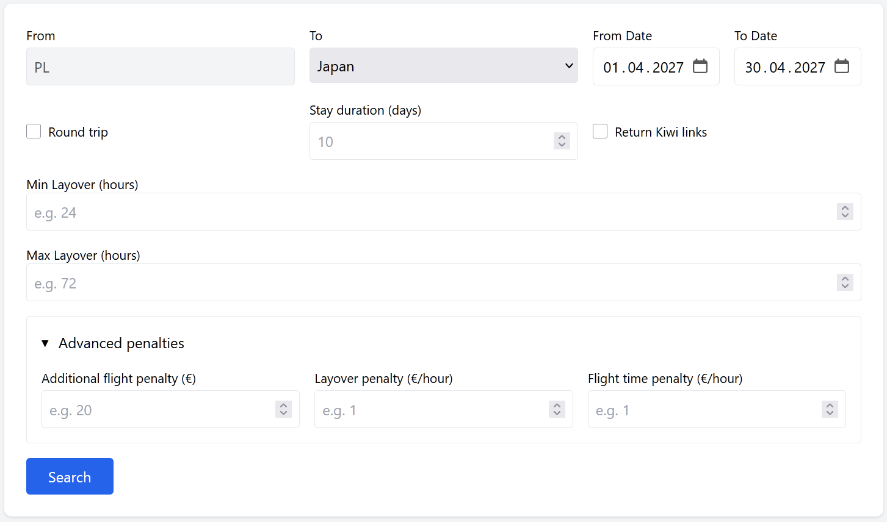
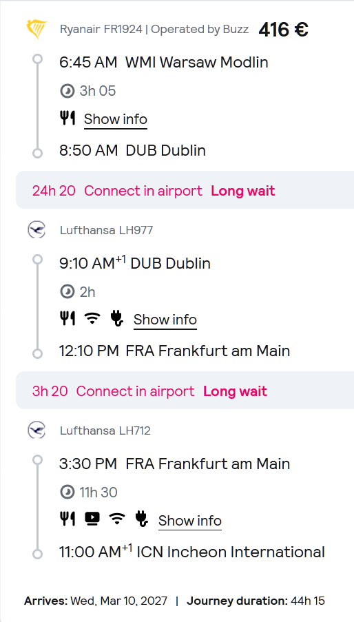
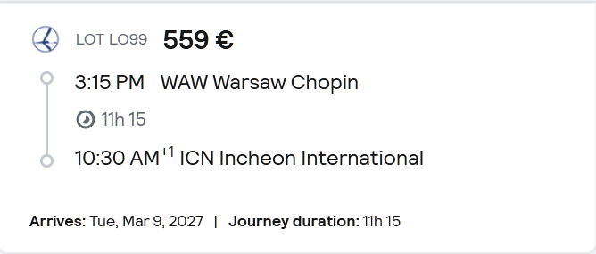
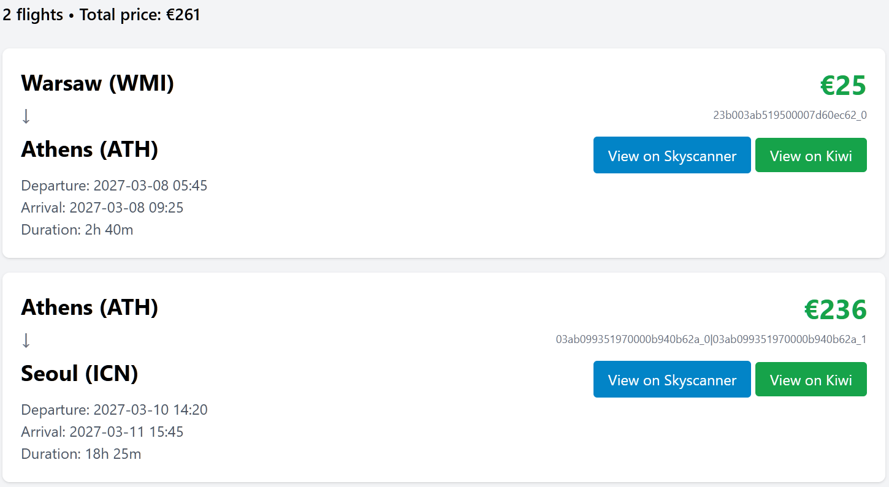
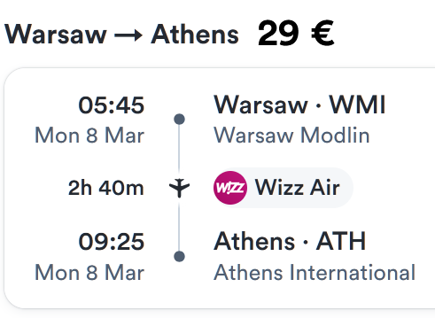
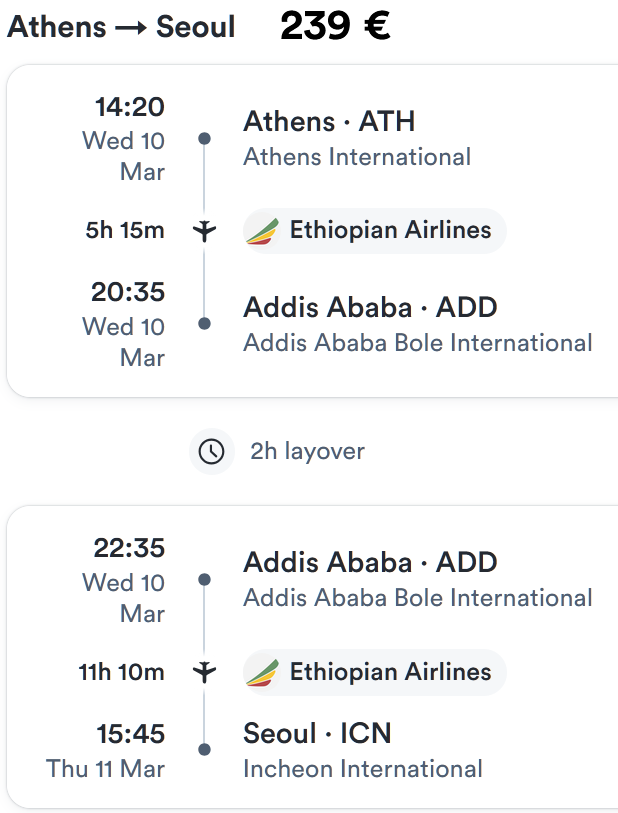
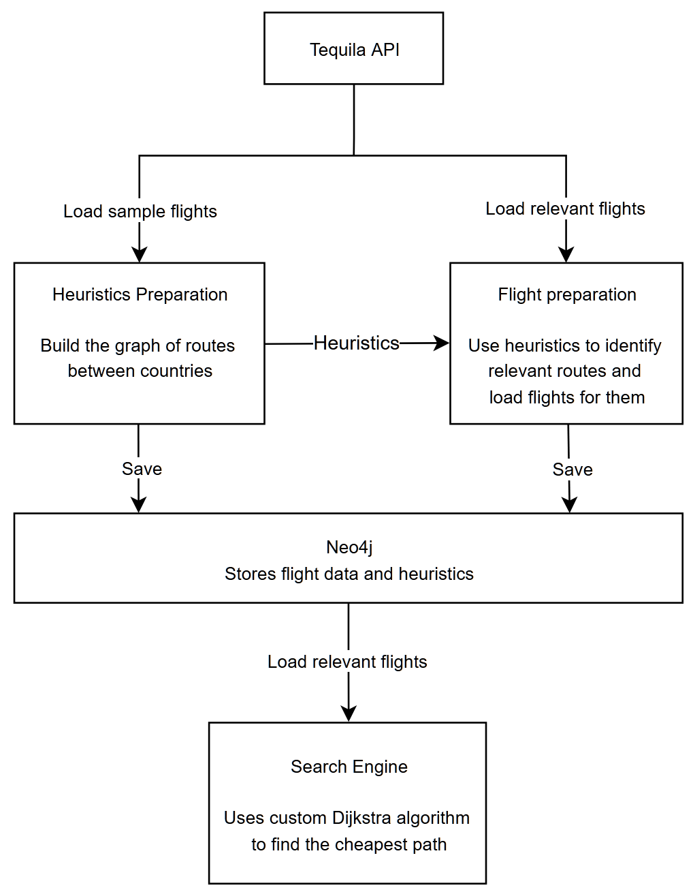

# Flight Search Engine

A flight search engine that analyzes **individual flights** and dynamically constructs itineraries instead of relying only on pre-combined routes provided by conventional search engines such as Skyscanner.

## Individual-Flight Search

Instead of simply searching for a complete itinerary, the engine treats individual flights as building blocks and constructs routes according to the user's constraints and preferences.

This makes it possible to:
* Find itineraries with **multi-day layovers**
* Combine flights from different airlines and routes
* Compare bundled fares with the cost of **buying the individual flights separately**, using whichever is cheaper
* Control how much additional cost is acceptable in exchange for fewer connections, shorter flight times, or shorter layovers.

The search uses a configurable cost function rather than optimizing flight price alone:

```text
total cost =
    flight prices
    + additional flight penalties
    + layover penalties
    + flight time penalties
```
This allows the user to control the trade-off between **price and convenience**.

For example, a user can choose whether an itinerary costing €350 with four flights is preferable to one costing €380 with only two flights. The difference is controlled through configurable penalties rather than a fixed ranking imposed by the search engine.

## Demo

A live version of the flight search is available here:

**[Open Flight Search Demo](http://51.21.11.251/search)**

### Using the search

Select the destination and the date range in which the trip should start and finish. The demo currently uses **Poland as the departure country**.

You can optionally configure:

* **Round trip** — search for a round trip itinerary.
* **Stay duration** — how many days to stay at the destination during a round trip.
* **Return Kiwi links** — include links to Kiwi.com for the flights found by the engine.
* **Min / Max Layover** — restrict how long connections between flights may be. These values can be set to multiple days to deliberately search for long stopovers.

### Price vs. convenience

The **Advanced penalties** section controls how the search trades price for convenience:

* **Additional flight penalty (€)** — the additional cost assigned to each extra flight in an itinerary. (default: €10)
* **Layover penalty (€/hour)** — assigns a cost to time spent between flights. (default: €0.50)
* **Flight time penalty (€/hour)** — assigns a cost to time spent flying. (default: €2)

For example, with a **€20 additional flight penalty**, a €300 itinerary with two flights can be preferred over a €290 itinerary with three flights,
because avoiding the additional flight is considered worth up to €20.



## Example

### Poland → South Korea

This example shows the difference between searching for conventional
itineraries and constructing routes from individual flights.

**Conventional flight search**

A conventional search engine returns a **€416 itinerary** as the
cheapest option, while a **€559 direct flight** is presented as a
more convenient alternative.

<div>
  
  
</div>

**Individual-flight search**

By analyzing individual flights and constructing the itinerary dynamically,
the engine finds a **€270 itinerary** that is not among the conventional
search results.



The screenshots below show the corresponding flights listed on Kiwi.com at the time of the search.

<div>
  
  
</div>

The engine finds a route with a full day in Athens before continuing the journey. Because individual flights are combined dynamically, the search can deliberately consider long or multi-day connections when they produce a lower-cost itinerary.

## Architecture

The application uses a two-stage data preparation process to avoid
loading the entire flight dataset.



### Stage 1 - Build Route Heuristics

The application initially loads a sample of flights from the Tequila API.

The sampled flights are used to build a country-level graph containing estimated price information between countries.

### Stage 2 - Prepare Flight Data

When an origin and destination are selected, the country-level graph is used to identify promising routes for that journey.

Yen's k-shortest-path algorithm finds multiple low-cost country sequences between the origin and destination.
These paths determine which country-to-country routes require detailed flight data.

The application then retrieves the corresponding flights from the Tequila API and stores them in Neo4j.

Only after this preparation is complete does the corresponding origin-to-destination search become available.

### Itinerary Search

The search engine loads the prepared flights into memory and constructs
itineraries using a time-dependent Dijkstra-based search.

The search considers flight prices, departure and arrival times,
connections, layovers, and configurable penalties when calculating the
cost of an itinerary.

## Technology

- **Java 25**
- **Spring**
- **Neo4j**
- **Gradle**